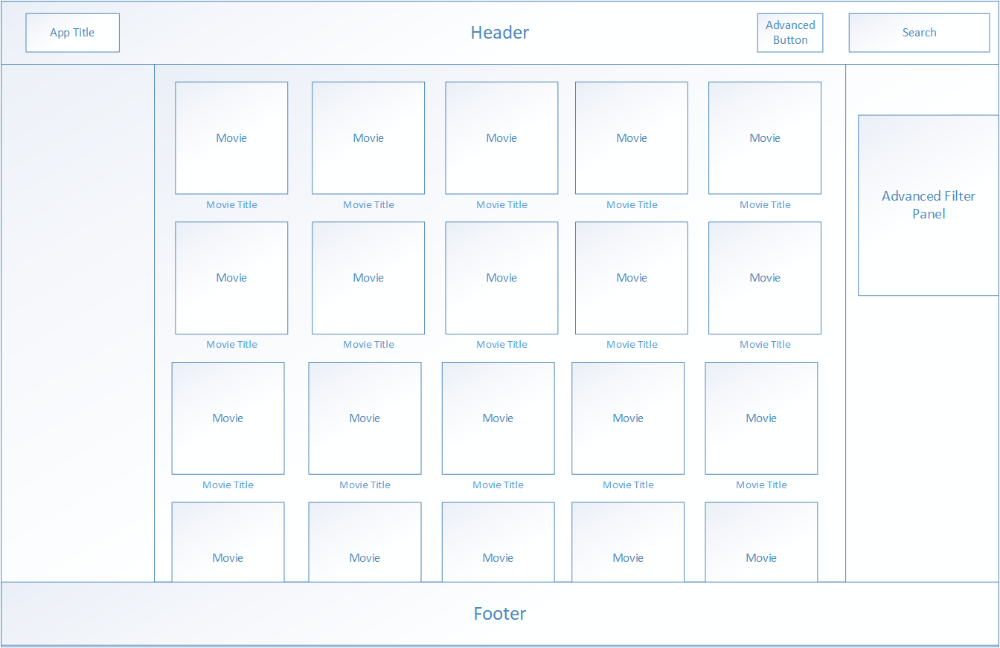
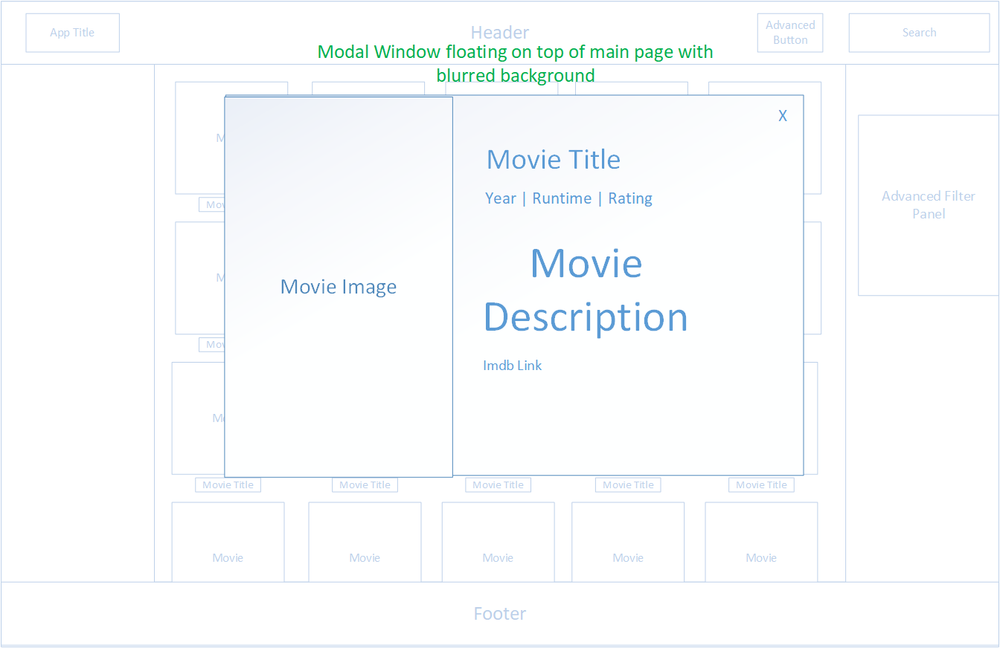
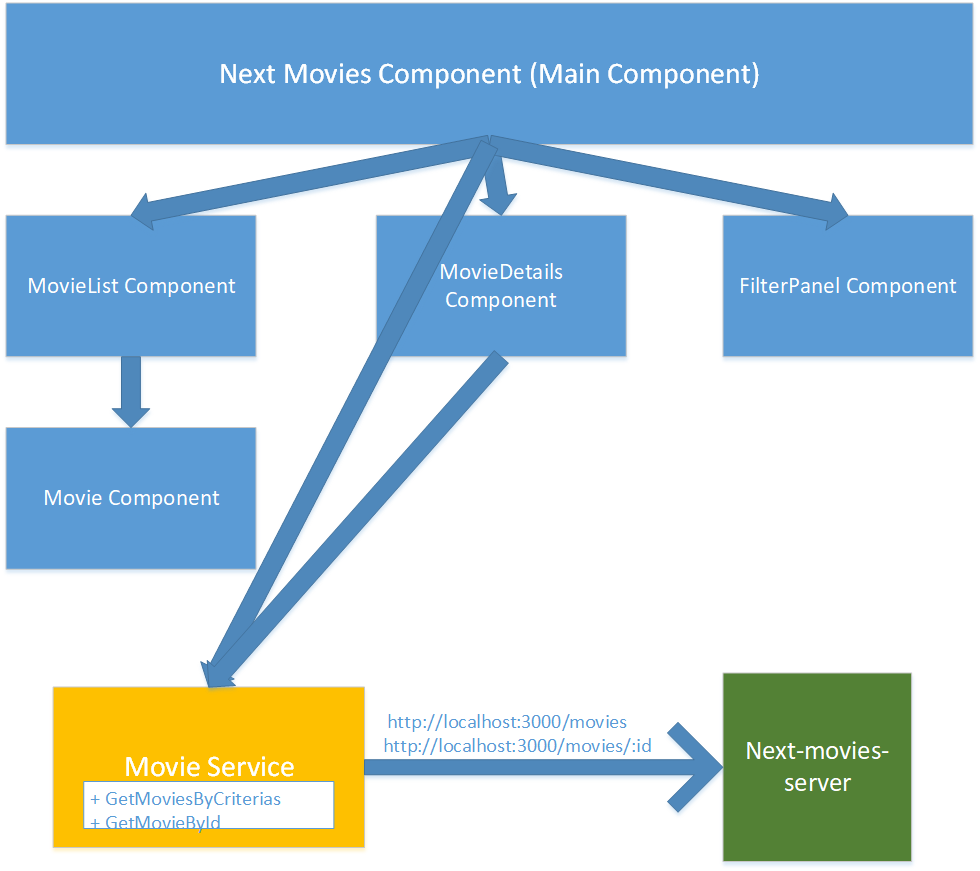

# next-movies-vue

## Prerequisites
1. npm: https://www.npmjs.com/get-npm
2. Vue: https://vuejs.org/
3. Run the following server with Cors enabled if runs on localhost
   https://github.com/next-insurance/next-test

## Installation
1. Download the repository
2. Install npm modules: `npm install`
3. In 'configuration.js' set 'apiUrl' to the url of the server
3. Start up the app: `npm run serve`
OR
1. Host 'dist' folder (built version) on website

## Run Unit Tests
1. Run `npm test`

### Design
Before I started the project, I've created the following design  
and written the following design notes.:
1. UI Mocks
Main Page:

  

 
 
2. 1. UI Mocks
Movie Details:

  

 
 
3. Class Diagram

  

### Design Notes
1. Images Lazy Loading (infinte scroll paging and native browser)
2. UI Routing - url will be updated with params and query params 
2.1. Thus supports link sharing
3. Search criterias: title, description, rating, runtime, year  
3.1. filter usually occures on server api however current api does not expose filtering  
Thus it will be done on client
4. State managment library (VueX) is overhead in such app therefore There is no need for that
5. Stuff to consider on API results:  
5.1. There are empty fields such as "rating", "runtime" etc   
Therefore need to remove when presenting if empty
5.2. Movie description and title are html, thus should be formatted
6. Window resize support
7. Hover will animate enlarged photo to provide flavor and give sense of responsive UI
8. For the sake of the excercise, use as less as bootsrap
9. Use imdb id to provide link to the movie on imdb website
  
### Libraries  
1. Infinite scroll: https://github.com/ElemeFE/vue-infinite-scroll
2. Search bar: https://github.com/trevoreyre/autocomplete
3. Vue slider: https://github.com/NightCatSama/vue-slider-component
4. Vue Html Format and Locale: https://kazupon.github.io/vue-i18n/introduction.html
5. Jest testing Library: https://jestjs.io/
6. Jest fetch mock: https://github.com/jefflau/jest-fetch-mock#typescript-guide

### To Do (leftovers)
1. Add year filter
2. Format runtime filter from minutes to hours and minutes
3. Add rating stars
4. When loading more images, display loading icon
5. Refactore get movies by criterias to smaller set of functions
6. Replace self implemented time formatter with third pary such as moment
7. Write unit tests to other components

### Future Features (next versions)
1. Add Login user and save favorites
2. Considering api provides - display trailer
3. Considering api provides - filter on server
4. Considering api provides - filter by genres
5. Sorting capability
6. Locale to Henrew and other languges if required

### Customize configuration
See [Configuration Reference](https://cli.vuejs.org/config/).
